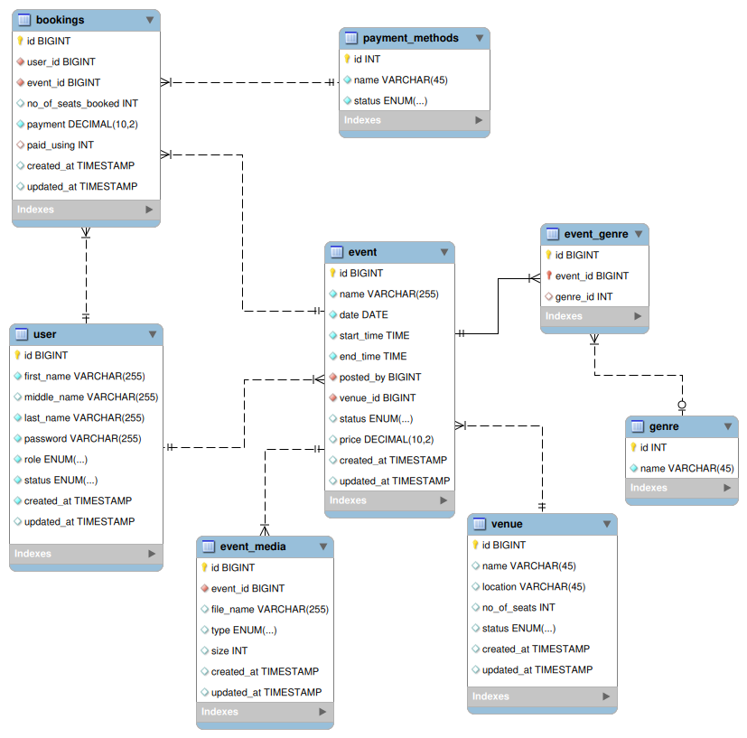

# INSTAILY ACADEMY WEB DEVELOPMENT BOOTCAMP 2024
## Event Management System

### Objective

To implement an event management system 

### Planned Features

1. User can view and buy tickets to an event 
2. User can post an event

### Proposed Website Design

Please refer to attached figma link [NOTE: Needs to be properly documented]

https://www.figma.com/design/H1D9Hbsgnt0ZP5LiSmuwW4/EMS-Plan?node-id=0-1&node-type=canvas&t=aGHHmzMu1nnFdaKv-0

### Planned Database Design

<figure>
    
    <figcaption><b>EMS Database Plan Layout</b></figcaption>
</figure>

Please refer to given workbench file

### Technologies Used

- Django Framework
- PayPal for Payments
- Ngrok
- Mailtrap for FakeSmtp Server

## Instructions

1. Dowload the event_management_system directory
2. You need a virtual environment to install and use Django and other packages. All required packages are provided in the install scripts.
    - If you do not have venv installed, use the command <code> pip install virtualenv </code> 
    - For Linux
        - You may need to run the command <code> chmod +x ./install.sh</code>
        - Then, simply run <code>./install.sh</code> and wait for the packages to install
        - To activate venv, run the command <code>source venv/bin/activate</code>. Make sure you are in the same directory as the new venv path
    - For windows
        - You may need to run the command <code>Set-ExecutionPolicy Unrestricted -Scope Process</code> to run scripts
        - Then, simply run <code>install.bat</code> and wait for the packages to install
        - To activate venv, run the command <code>venv\Scripts\activate</code>. Make sure you are in the same directory as the new venv path
3. Go into the event_management_system directory from the command line.
4. Remove .example from provided .env file and setup valid credentials 
5. Run the command to make initial migration to enable Django features: <code>python manage.py migrate</code>    
6. Run the server using the command <code>python manage.py runserver</code>, and access it via the link [127.0.0.1:8000](127.0.0.1:8000)
